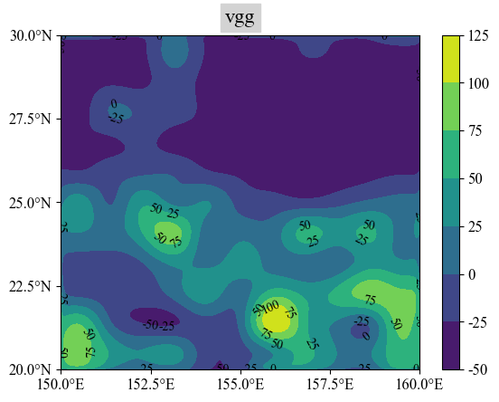
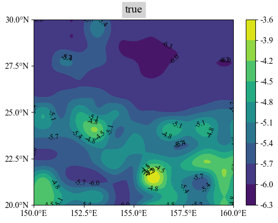
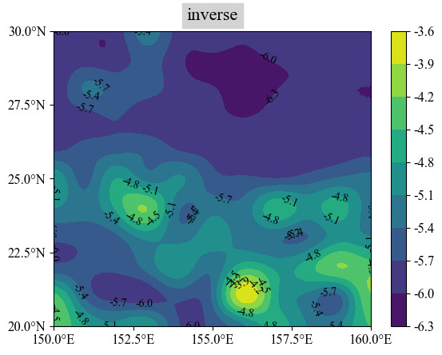
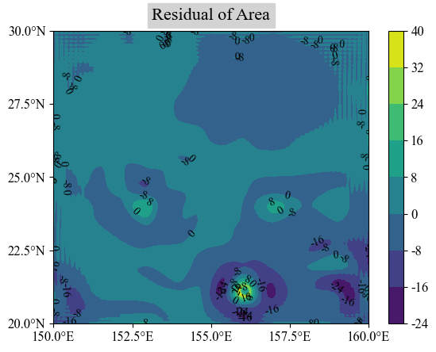
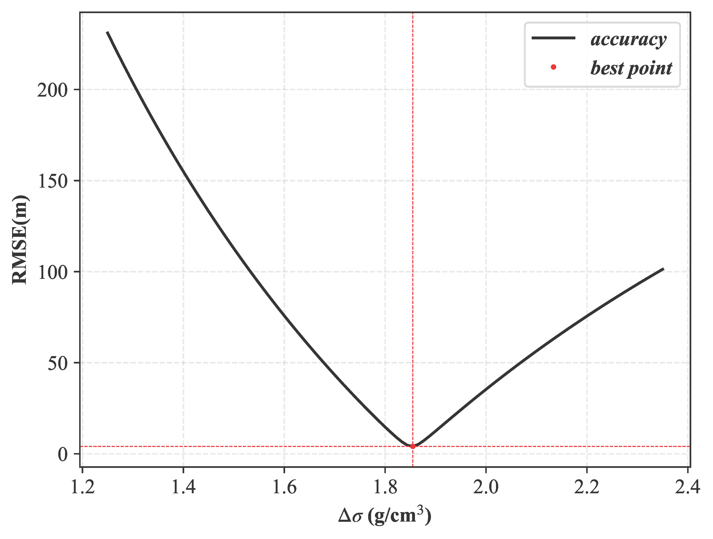
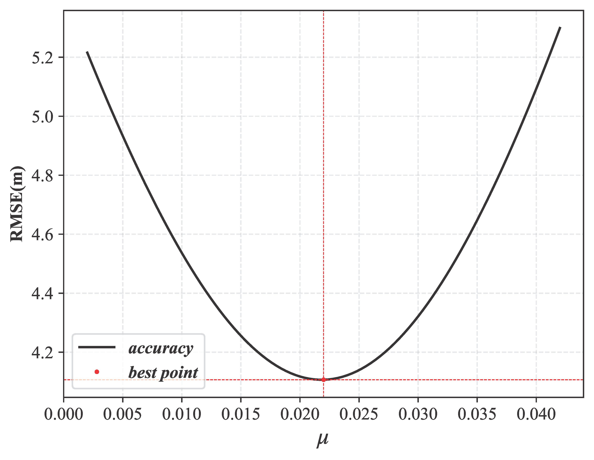

# pyParkO
## Description
pyParkO is a Python package designed to reconstruct the seafloor topography from gravity anomalies. The Parker-Oldenburg method has been widely studied for its fast calculations and flexibility in constructing complex topographies. The Parker’s formula was initially proposed by Parker in his 1973 paper, “The rapid calculation of potential anomalies.”, which is an iterative potential field method that calculates gravity anomalies from the density interface within the frequency domain. Subsequently, Oldenburg refined the Parker’s formula and introduced an iterative algorithm in his 1974 paper, “The inversion and interpretation of gravity anomalies.”, which can invert density interfaces from gravity anomalies, specially reconstructing seafloor topography from gravity anomalies. The earlier available package of Parker-Oldenburg method is coded in MATLAB (Gómez-Ortiz and Agarwal, 2005). We introduce an efficient Python package entitled pyParkO, which incorporates both constant and varying density contrast models for the Parker-Oldenburg method to facilitate inversion of the seafloor topography based on gravity anomalies. This package primarily integrates a forward modeling program, Interface2Gravity, which calculates gravity anomalies from seafloor topography, and an inversion program, Gravity2Interface, which reconstructs seafloor topography from gravity anomalies. It also includes a plotting tool for visualizing results.

### Abstract
`pyParkO` is a Python-based algorithm implementation of the Parker-Oldenburg method for: 
1. **Forward modeling**: Calculating gravity anomalies from the density interface.  
2. **Inverse modeling**: Recovering the density interface from gravity anomalies.  

### Key Features  
- A Parker-Oldenburg toolkit containing:  
  - Forward program (`density interface → gravity anomalies`).  
  - Inversion program (`gravity anomalies → density interface`), optimized for reconstructing **seafloor topography** from gridded gravity data.  
- Extended capability to handle **variable density-contrast scenarios** (implemented in this package).  
- **Critical note**: When `mu=0`, the variable density-contrast formula simplifies to the original Parker-Oldenburg method.  

### Functionality  
✅ Parameter tuning for constant/variable density-contrast models.  
✅ Regional adaptability for seafloor topography inversion.  
✅ Built-in visualization tools for forward/inverse results.

## Installation
<code>pip install pyParkO</code>

## Requirements
- numpy
- matplotlib
- scipy
- math
- os
```python
import numpy as np
```

## Usage
The sketch above illustrates the three components of "pyParkO": Interface2Gravity, Gravity2Interface, and Ploter. These components are implemented as classes. The functional class Interface2Gravity is used for the forward calculation of gravity anomalies. The method forward(t) calculates the gravity anomalies at the t-th step based on the density interface. The functional class Gravity2Interface, downward(t), which calculates the undulations of the density interface at the t step based on gravity anomalies and the density interface from the t − 1 step of the iterative process. The class Ploter provides several plotting functions, including 2-D contour plots (plt_contourf), 3-D space plots (plt_3d), and geological section plots (plt_section), to facilitate visualization of results from forward and inverse modeling programs. In addition, it includes drawing commands with dual parameter adjustment (plt_twin).

### Generate the gravity anomalies
To run the demo, you must import the library:
```python
from pyParkO import Interface2Gravity
```
We selected the Western Pacific region: Area (150°E~160°E, 20°N~30°N)
```python
# Read data (the data from Crust 1.0)
interface_depth = np.loadtxt('interface_depth.csv', delimiter=',')
# The reference depth of the density interface
reference_depth = np.mean(-interface_depth)
# the undulations of the density interface
delta_bnd = -interface_depth - reference_depth
# The initial density contrast for the density interface
delta_sigma = 1.85
# The attenuation factor of density contrast for the interface
mu = 0.022
# A numerical value representing the spherical distance (in kilometers) of the ocean area being studied along the meridional direction
longrkm = 1111.949
# A numerical value representing the spherical distance (in kilometers) of the ocean area being studied along the vertical direction
longckm = 1007.539
```

The reasonable set of input parameters for Interface2Gravity is as follows, which includes the true seafloor topography from Crust 1.0. Additionally, the version (constant density contrast (CDM) or varying density contrast (VDM)) is determined based on the value of mu:
```python
parameters = {
    "delta_bnd": delta_bnd,
    "delta_sigma": delta_sigma,
    "mu": mu,
    "reference_depth": reference_depth,
    "longrkm": longrkm,
    "longckm": longckm,
}
```

The interfacetogravity object can be created using the 'forward' method，which generates the gravity anomalies.  
```python
# Forward modelling
mf = Interface2Gravity(**parameters)
vgg = mf.forward(t=8)
```

The gravity anomalies can be visualized using the plt_contourf of 'Ploter' class to create a 2-D contour map.
```python
# Visualize 2-D contour map
from pyParkO import ptr
x_ticks = ['150.0°E', '152.5°E', '155.0°E', '157.5°E', '160.0°E']
y_ticks = ['20.0°N', '22.5°N', '25.0°N', '27.5°N', '30.0°N']
ptr.plt_conterf(vgg, x_ticks, y_ticks, colorbar="vertical", title="vgg")
```



### Invert the seafloor topography
To run the demo, you must import the library:
```python
from pyParkO import Gravity2Interface
```

The reasonable set of input parameters for Gravity2Interface is as follows, which includes the gravity anomalies generated by the Interface2Gravity class. Additionally, the version (constant density contrast (CDIM) or varying density contrast (VDIM)) is determined based on the value of mu:
```python
# The two parameters of the filter
wh = 0.45
alpha = 8

parameters = {
    "vgg": vgg,
    "delta_sigma": delta_sigma,
    "mu": mu,
    "reference_depth": reference_depth,
    "longrkm": longrkm,
    "longckm": longckm,
    "wh": wh,
    "alpha": alpha,
}
```

The gravitytointerface object can be created using the 'downward' method, which inverts the seafloor. 
```python
# inverse modelling
mi = Gravity2Interface(**parameters)
inverse_topography = mi.downward(t=8)
```

Due to the boundary effect of the Fourier transform, we cropped 30 grids near the terrain edge.
```python
def shrink_edge(data, n_col, m_row, n_col_l, m_row_l):
    m_left = int(np.floor((n_col_l - n_col) / 2))
    m_up = int(np.floor((m_row_l - m_row) / 2))
    data_shrink = data[m_up + 1:m_up + 1 + m_row, m_left + 1:m_left + 1 + n_col]
    return data_shrink

true_topography = shrink_edge(interface_depth, 541, 541, 601, 601)
inverse_topography = shrink_edge(inverse_topography, 541, 541, 601, 601)
```

The seafloor topography can be visualized using the plt_contourf of the Ploter class to create 2-D contour map. 
```python
# Visualize 2-D contour map
ptr.plt_conterf(true_topography, x_ticks, y_ticks, colorbar="vertical", title="true")
ptr.plt_conterf(inverse_topography, x_ticks, y_ticks, colorbar="vertical", title="inverse")
```




We further presents the 2-D planar differential contour maps between the inverted seafloor topography and the true seafloor topography from Crust 1.0:
```python
ptr.plt_conterf((true_topography-inverse_topography)*1000, x_ticks, y_ticks, colorbar="vertical", title=f"Residual of Area")
```



### Parametric Exploration
For the constant density contrast inversion model (CDIM), we investigated the effect of variations in delta_sigma on the precision of the inversion. The CDIM iterative step size for delta_sigma is set to 0.2. As delta_sigma increases, the RMSE first decreases and then increases. We use the plt_twin method of the Ploter class to visualize this result:

Since the difference between CDIM and VDIM lies in the value of the parameter mu, we further explored the parameter mu for VDIM based on the optimal density contrast. We also visualized this result using the plt_twin method of the Ploter class:


## References
Parker, R., 1973. The rapid calculation of potential anomalies. Geophysical Journal International 31, 447–455.

Oldenburg, D.W., 1974. The inversion and interpretation of gravity anomalies. Geophysics 39, 526–536.

Gómez-Ortiz, D., Agarwal, B.N., 2005. 3dinver. m: a matlab program to invert the gravity anomaly over a 3d horizontal density interface by parker–oldenburg's algorithm. Computers & geosciences 31, 513–520.

